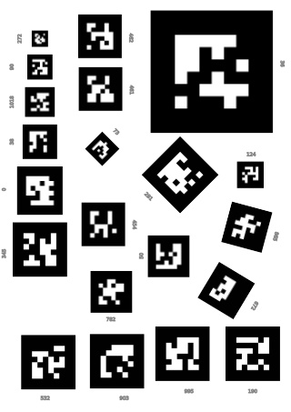

Benchmarking 2D marker tracking libraries
=========================================

This project aims at providing a rigorous framework to benchmark
the main open-source libraries for 2D marker detection and tracking.

The contenders we have considered so far are:

- [ALVAR](http://virtual.vtt.fi/virtual/proj2/multimedia/alvar/) (LGPL 2.1)
- [Aruco](http://www.uco.es/investiga/grupos/ava/node/26) (BSD)
- [chilitags](http://chili.epfl.ch/software) (LGPL 3) **[disclaimer: we are the
  authors of chilitags!]**

We plan to add soon [ARToolkit](http://artoolkit.sourceforge.net/) (but this
library is older, and more difficult to integrate).

Methodology
-----------

Several criteria must be taken into account when comparing libraries:
performances, but also documentation, ease of use (build system, reliance on
standards, etc), community...

This benchmark currently only focuses on a single performance metric: detection
speed of markers in a static image.

We rely on a common layout of markers (pictured above), with markers adapted to
each libraries, then precisely time to **detection** duration (ie, without the
time to load the image or display the results), and finally average the result
on 20 runs.

The base image has a resolution of 800x1131 pixels (A4 at ~96dpi).

We use default configurations for the libraries, but when they expose different
presets, each of them has been tested. Please feel free to send over an
[email](mailto:severin.lemaignan.youknowthatthispartdoesnotneedtobethere@epfl.ch)
if you want to suggest more appropriate settings.

Detection speed results
-----------------------

|Library| Average processing time (ms) | Std deviation | Missed markers |
|-------|-----------------------------:|--------------:|----------------|
| `alvar` (default) | 10.1687 |        0.6 | 672,  |
| `aruco` (default) | 8.3 |        1.7 | 272,  |
| `chilitags` (`ROBUST` preset) | 44.9 |        1.2 |  |
| `chilitags` (`FAST` preset) | 20.8 |        0.8 |  |
| `chilitags` (`FASTER` preset) | 10.7 |        0.8 |  |

Next steps
----------

- Include ARToolkit
- test at different resolutions
- use non-synthetic datasets
- benchmark robustness

